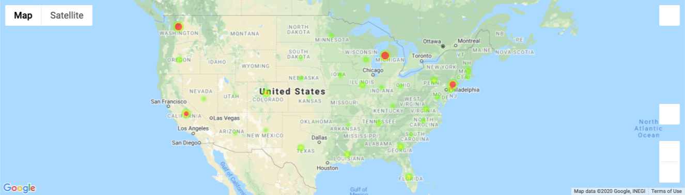
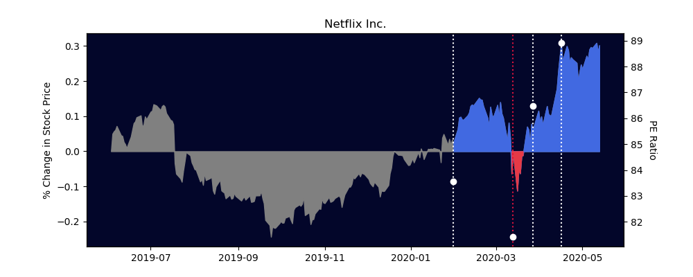
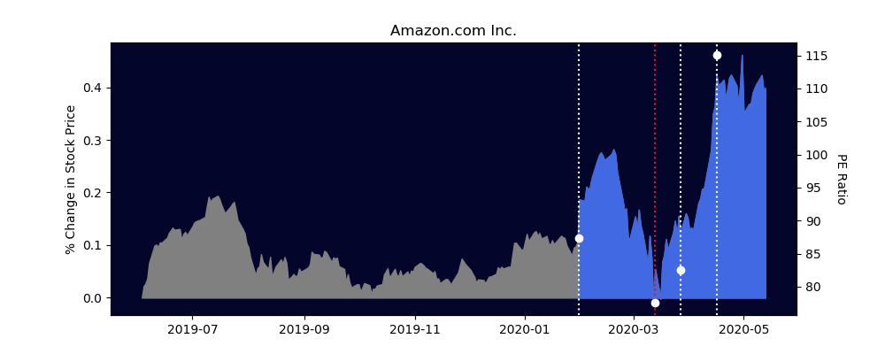
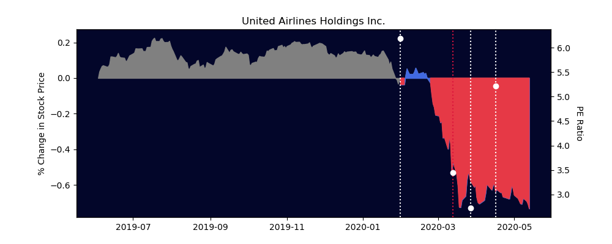

# Project: Covid-19 Effects on the Economy
## Summary
There is no question that COVID-19 had an unprecedented effect on our economy. The Pandemic Pandas took a deeper dive into several companies to see just how much of an impact the virus had across industries, and is it all bad?  
​
## Questions We Asked
* What are the effects of Covid-19 on company/stock performance?
* Which industries/companies performed well and which performed poorly?
* What companies/products/services are considered essentials?
* What lessons can we learn from companies who thrived during this pandemic?
​
## Scope
* Timeline: identify major milestones of Covid-19 
* Publicly-traded companies
* Domestic data
* Consumer brands
* Diverse industries 
​
## Data
* Stock performance
* Price-to-earnings ratio
* Hires/layoffs in the last month
* Quarterly report press releases

## Data Analysis
### Covid-19 Cases Across the US

Sample visuals using gmaps:

### Company Stock/Financial Analysis

Sample visuals using matplotlib:

### Company Quarterly Earnings Report Press Release

Sample visuals using wordcloud:

## Data Sources
* AlphaVantage API
* Yahoo Finance API
* Bloomberg Finance API
* Covid 19 API
* Goggle Maps API
* LinkedIn
* Company quarterly earnings report and press release
​
## Analytic Tools
* Python
* Jupyter Notebook
* Libraries include: Pandas, Numpy, Gmap, Matplotlib, Requests, Pathlib, OS, Docx2txt, WordCloud, NLTK

### For full presentation, click [here](covid19_presentation.pdf)